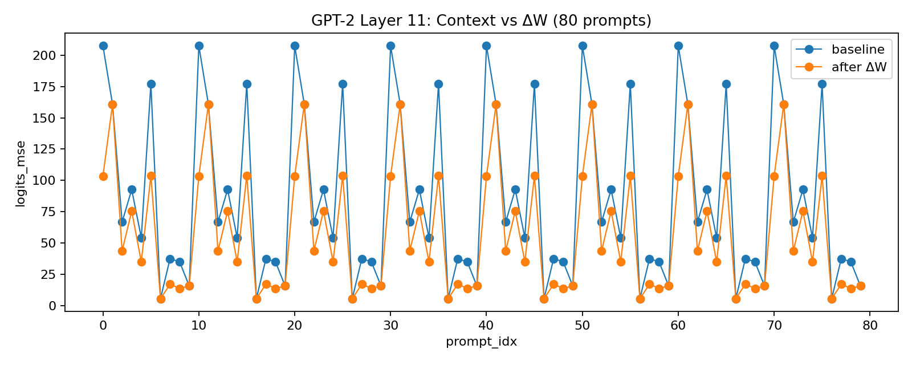

# In-Context Learning — Practical ΔW Steering on GPT‑2

This repo demonstrates a practical version of the "Learning without Training" idea on real pretrained GPT‑2/DistilGPT2 models. We compute a tiny rank‑1 weight patch (ΔW) from live activations induced by context and apply it to a chosen MLP layer to steer the model’s logits—no gradient training, no labels.

- Models: Hugging Face `gpt2`, `distilgpt2`
- Mechanism: Rank‑1 ΔW to `mlp.c_fc` of a chosen `transformer.h[layer]`
- Metric: Last‑token logits MSE between contextual vs query‑only runs, before/after ΔW
- Evidence: Strong improvements on GPT‑2, especially at the last layer (layer 11)

## Key Result (GPT‑2, Layer 11)
On 80 prompts with per‑sample ΔW and a fast α line-search:

- 70% of prompts improved
- Mean MSE drop: 27.9
- Median MSE drop: 19.8
- Mean baseline → after: 85.2 → 57.4

Figures:

- Per‑prompt MSE (baseline vs after ΔW):

  

- Histogram of drops (baseline − after):

  

CSV: `gpt_experiments/gpt2_layer11_80.csv`

## Why it matters (real‑life use)
- Rapid session adaptation without fine‑tuning
- RAG corrective patches after retrieval
- Temporary policy/tone injection for compliance/brand
- Few‑shot specialization (sales/support style) without training jobs
- Reversible and targeted edits (rank‑1/low‑rank updates)

## How it works
Code lives under `gpt_experiments/`:

- `verify_distilgpt2.py` — Runs the ΔW verification experiment
  - Captures pre‑MLP activations via a forward hook at `ln_2` (`capture_block_pre_mlp()`)
  - Computes ΔA = A(C,x) − A(x) and builds a rank‑1 ΔW (`compute_delta_rank1()`)
  - Applies ΔW to the chosen layer’s `mlp.c_fc.weight` (`apply_delta_block()`)
  - Two‑stage α search (coarse→fine) applied in‑place for speed
  - Outputs CSV with per‑prompt baseline and after‑ΔW MSE; prints per‑layer summaries

- `gpt2_delta_demo.py` — Interactive demo
  - Provide a context and a query
  - Shows baseline vs after‑ΔW logits MSE and generations

- `plot_csv.py` — Minimal plotting tool for CSVs

## Reproduce the main figure
Environment (Python 3.10+ recommended). Install:

```bash
pip install -r gpt_experiments/requirements.txt
```

Run best layer (11) on 80 prompts:

```bash
python3 gpt_experiments/verify_distilgpt2.py \
  --model gpt2 --num_prompts 80 --k_support 4 \
  --out_csv gpt_experiments/gpt2_layer11_80.csv \
  --device cpu --per_sample --alpha_max 2.0 --alpha_steps 11 --layer 11
```

Plot the results:

```bash
python3 gpt_experiments/plot_csv.py \
  --input gpt_experiments/gpt2_layer11_80.csv \
  --out gpt_experiments/gpt2_layer11_80.png \
  --title "GPT-2 Layer 11: Context vs ΔW (80 prompts)"
```

You will also get `gpt2_layer11_80_drops.png`.

## Quick interactive demo
```bash
python3 gpt_experiments/gpt2_delta_demo.py --model gpt2 --device cpu \
  --alpha_max 2.0 --alpha_steps 21 \
  --context "January -> 1. February -> 2. March -> 3. April -> 4." \
  --query "The number for April is" --max_new_tokens 30
```

## Notes and limitations
- Rank‑1 ΔW captures a significant but not full context effect; multi‑layer/multi‑head residual structure limits exact equality.
- We optimize α per prompt via a small search; we do not retrain any weights.
- The update is applied in‑place but restored between evaluations.

## Roadmap (optional extensions)
- JVP‑based ΔW direction (more principled than the current heuristic)
- Rank‑k updates via SVD over per‑prompt differences
- Control experiments (random ΔW, shuffled context)
- GPU acceleration for larger sweeps

## Citation / Reference
- Paper: “Learning without Training” (see `Learning without Training.pdf` in this repo)
- Models: Hugging Face `gpt2`, `distilgpt2`

---
If you use this code or find the idea useful, consider ⭐ the repo and share your results!
